# ITC6110 — Natural Language Processing  
## Group Project Report  
**Module:** ITC 6110 — Natural Language Processing  
**Term:** Spring Semester 2025  
**Team Members:** [NAME 1] · [NAME 2] · [NAME 3]  
**Submission Date:** [DATE]  

---

## Abstract

This report documents an end-to-end NLP pipeline applied to the BBC News dataset (2,225 articles, 5 categories), covering data collection, preprocessing, feature engineering, topic modelling, text classification using both traditional machine learning and deep learning, a Retrieval-Augmented Generation (RAG) conversational system, and an interactive Streamlit application deployed on HuggingFace Spaces. Our best classifier, fine-tuned DistilBERT, achieves 97.21% accuracy and 0.971 macro F1 — a margin of two test articles over a Linear SVM (97.00%, 0.969), which we argue is not a meaningful difference. A from-scratch BiLSTM reaches only 81.55%; this 15.7-point gap between our two *neural* models, set against a 0.21-point gap between a transformer and a bag-of-words model, isolates pre-training rather than architectural depth as the variable driving performance. LDA selects ten topics over the five editorial categories, discovering sub-structure the labels do not encode. The RAG system achieves a mean ROUGE-L of 0.155, which we demonstrate is dominated by the metric's inability to credit correct-but-terse answers rather than by retrieval failure.

---

## 1. Data Collection

### 1.1 Dataset

We used the **BBC News dataset** (Greene & Cunningham, 2006), sourced from HuggingFace Hub (`SetFit/bbc-news`): **2,225 news articles** collected from the BBC website between 2004 and 2005, labelled across five mutually exclusive categories.

| Category      | Train | Test | Total |
|---------------|-------|------|-------|
| Business      | 286   | 224  | 510   |
| Entertainment | 210   | 176  | 386   |
| Politics      | 242   | 175  | 417   |
| Sport         | 275   | 236  | 511   |
| Tech          | 212   | 189  | 401   |
| **Total**     | **1,225** | **1,000** | **2,225** |

Articles average ~390 words. Class balance is favourable — the largest category is only 1.32× the smallest — so no resampling or class weighting was required.

### 1.2 Dataset Justification

BBC News was selected for four reasons. It is **multi-class rather than binary**, requiring genuine topic classification rather than sentiment polarity. It is **professionally labelled at source** — the categories are the BBC's own editorial sections — so labels required no manual annotation, letting our effort go into modelling. It is **large enough to fine-tune a transformer yet small enough to iterate on a laptop**. Most importantly, the articles are **substantive prose rather than short ratings or captions**, which is what makes one corpus simultaneously suitable for topic modelling, classification *and* retrieval-augmented question answering.

### 1.3 Loading the Data

The dataset was loaded via the HuggingFace `datasets` library and saved locally as `data/raw/bbc_news.csv`, fixing the dataset version so results remain reproducible if the upstream Hub entry changes:

```python
from datasets import load_dataset
import pandas as pd
ds = load_dataset("SetFit/bbc-news")
df = pd.concat([pd.DataFrame(ds['train']).assign(split='train'),
                pd.DataFrame(ds['test']).assign(split='test')])
df.to_csv('data/raw/bbc_news.csv', index=False)
```

**Figure 1:** Article count and proportional distribution per category  
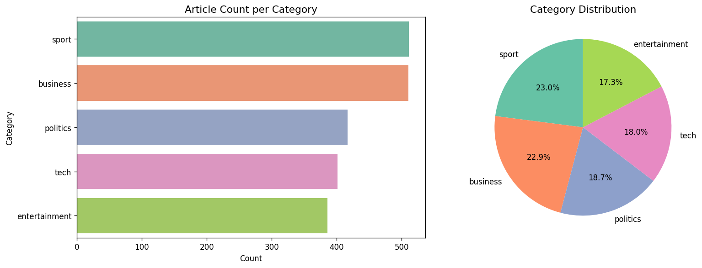

**Figure 2:** Article length distribution by category  
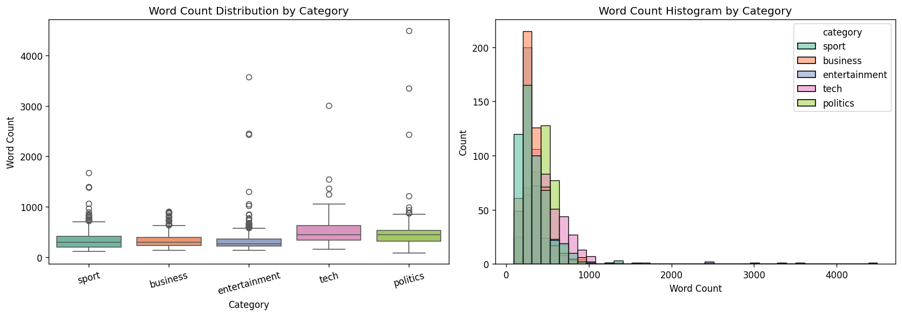

---

## 2. Data Preprocessing and Normalisation

### 2.1 Pipeline Overview

Preprocessing was implemented in Notebook 1 and applied in sequence: **lowercasing** (so "Football" and "football" are one feature); **URL and HTML removal** via regex, as markup carries no topical signal; **contraction expansion** through a lookup table (`n't` → ` not`); **punctuation and special-character removal**; **stop word removal** using NLTK's English list; **short-token filtering**, dropping tokens of ≤2 characters as residual noise; **lemmatisation** with WordNetLemmatizer; and **tokenisation** via `word_tokenize`.

Contraction expansion is placed deliberately **before** punctuation removal: reversing the order would turn "don't" into the out-of-vocabulary token "dont" rather than the intended "do not", destroying the negation entirely.

### 2.2 Missing and Duplicate Values

No missing values were found in any field. Checking for exact duplicates (rows identical across all columns) flagged **57 rows**. Deduplication was then applied on the article **text** alone (`drop_duplicates(subset='text')`), which removed **99 rows in total** — the 57 exact duplicates plus **42 articles that appeared in both the train and test split** (identical text, different split label). This left **2,126 unique articles**. Deduplicating on text rather than on the full row is deliberate: those 42 cross-split articles are a genuine train/test leak — an article seen in training would be classified correctly at test time for free — so removing them before modelling prevents artificially inflated test accuracy.

| Category      | Train | Test | Total |
|---------------|-------|------|-------|
| Business      | 282   | 221  | 503   |
| Entertainment | 206   | 163  | 369   |
| Politics      | 236   | 167  | 403   |
| Sport         | 274   | 230  | 504   |
| Tech          | 196   | 151  | 347   |
| **Total**     | **1,194** | **932** | **2,126** |

All accuracy figures in Section 4 are therefore measured on **932 test articles**, not 1,000.

### 2.3 Stemming vs Lemmatisation

We chose **lemmatisation** because it preserves valid English words, improving both downstream embedding quality and the human readability of our LDA topic keywords and Word2Vec neighbour lists. Stemming conflates unrelated terms on shared prefixes (the Porter stemmer maps "universal", "university" and "universe" all to "univers"). Since two of our deliverables are *read by humans as evidence*, interpretability outweighed stemming's modest speed advantage.

### 2.4 Design Decision: Two Text Representations

Two versions of the text were retained: `text` (original, used by **DistilBERT** and the **RAG retriever**) and `text_processed` (lemmatised, used by **Word2Vec, TF-IDF, LDA and the BiLSTM**).

This is deliberate matching of representation to model, not redundancy. Transformers ship their own subword tokeniser and were pre-trained on natural text complete with punctuation and function words; feeding them lemmatised input discards signal they already know how to exploit. Count-based and from-scratch models conversely benefit from the dimensionality reduction cleaning provides. A worked example (**Appendix A.1**) shrinks from 630 words to 318 tokens — a 49.5% reduction — while every topically diagnostic term survives. What is lost is grammar, not content: exactly the trade a bag-of-words model wants and a transformer does not.

---

## 3. Feature Engineering and Text Visualisation

### 3.1 TF-IDF

A TF-IDF matrix was built over the deduplicated corpus with `max_features=10_000`, `ngram_range=(1, 2)` and `min_df=2`, producing a sparse **2,126 × 10,000** matrix. The **bigram range** captures multi-word units such as "prime minister" or "champions league" whose meaning is not recoverable from the individual words; **`min_df=2`** discards single-document terms, overwhelmingly typos and unique proper nouns that cannot generalise; the **10,000-feature cap** bounds training time while retaining the most informative terms. TF-IDF feeds the classical classifiers in Section 4.2.

### 3.2 Word2Vec Embeddings

A **Skip-gram Word2Vec** model was trained from scratch using Gensim (`vector_size=100`, `window=5`, `min_count=2`, `sg=1`, `epochs=10`), yielding a **15,986-word** vocabulary. Skip-gram was chosen over CBOW as it performs better on smaller corpora and infrequent words — both relevant given ~2,100 documents and a long tail of athlete and company names. Document vectors were obtained by mean-pooling each article's word vectors, producing a **2,126 × 100** matrix.

**Nearest neighbour queries.** Step 3 requires a solution returning the N most similar words to a query; we implemented `get_similar_words()` over Gensim's cosine similarity index. Results for five queries are tabulated in full in **Appendix A.2**. They are strong evidence the model learned genuine semantics without supervision: the `injury` neighbourhood consists *entirely* of body parts and medical terms (knee 0.784, hamstring 0.779, ligament 0.717) despite the model never being told what an injury is, and `olympic` recovers real Olympic entities — Kelly Holmes, Paula Radcliffe, Haile Gebrselassie, Athens — alongside event vocabulary.

The failure cases are equally instructive (Appendix A.2): `transfer` returns a noisy mix because the word is polysemous in a news corpus — football transfers, business asset transfers, data transfers — so its context vectors average across three unrelated senses. This is the defining limitation of static embeddings, one vector per word type regardless of sense, and precisely what contextual models such as BERT were designed to overcome. We return to this point in Section 4.2.1, because it explains our headline result.

### 3.3 t-SNE Visualisation

t-SNE (`perplexity=30`, `max_iter=1000`, Barnes-Hut) projected the 100-dimensional document vectors into 2D.

**Figure 3:** t-SNE projection of Word2Vec document embeddings  
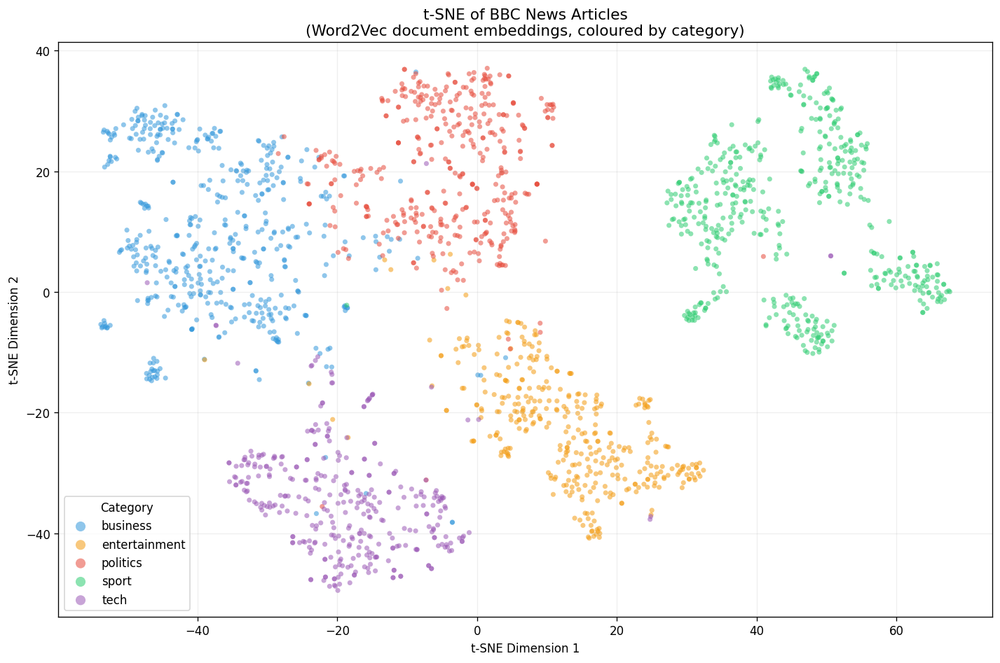

The projection shows **five clearly resolved clusters with minimal cross-contamination** — notable because t-SNE never sees the labels; the colouring is applied afterwards, so the separation is entirely a property of the unsupervised embedding space.

**Sport (green) is the most isolated category by a wide margin**, occupying the right-hand third and separated from everything else by a substantial gap, reflecting its distinctive, self-contained vocabulary. **Business (blue) and politics (red) touch along a shared boundary**, which is semantically sensible: articles on budgets and regulation legitimately belong to both and share terms such as "government" and "market". **Tech (purple) and entertainment (orange)** occupy the lower half, with tech bleeding slightly into business — again reasonable, since technology-company earnings stories sit genuinely between the two.

Two further observations matter. The visibly misplaced points — a green sport dot inside the business cluster, isolated tech points near politics — are exactly the ambiguous articles we expect our classifiers to miss, and the ~3% error rates in Section 4.2.1 are consistent with this. More significantly, **several clusters show clear internal sub-structure**: sport resolves into at least three sub-blobs. This anticipates Section 4.1, where coherence optimisation selects ten topics rather than five — the sub-structure visible here geometrically is the same structure LDA finds probabilistically.

**Figure 4:** Embedding comparison — t-SNE on Word2Vec vs. TF-IDF (via SVD)  
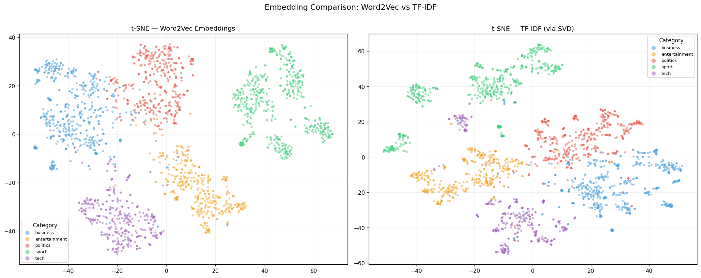

As an optional extension we repeated the projection on TF-IDF, reduced to 50 dimensions with TruncatedSVD first (t-SNE is impractical on 10,000 sparse dimensions). The comparison isolates what each representation captures: TF-IDF measures lexical overlap, whereas Word2Vec captures distributional semantics, placing articles close if they use *related* words, even different ones.

### 3.4 Word Frequency Visualisation

**Figure 5:** Top 20 tokens per category after preprocessing  
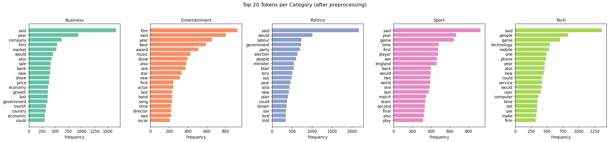

**Figure 6:** Word cloud — sport articles  
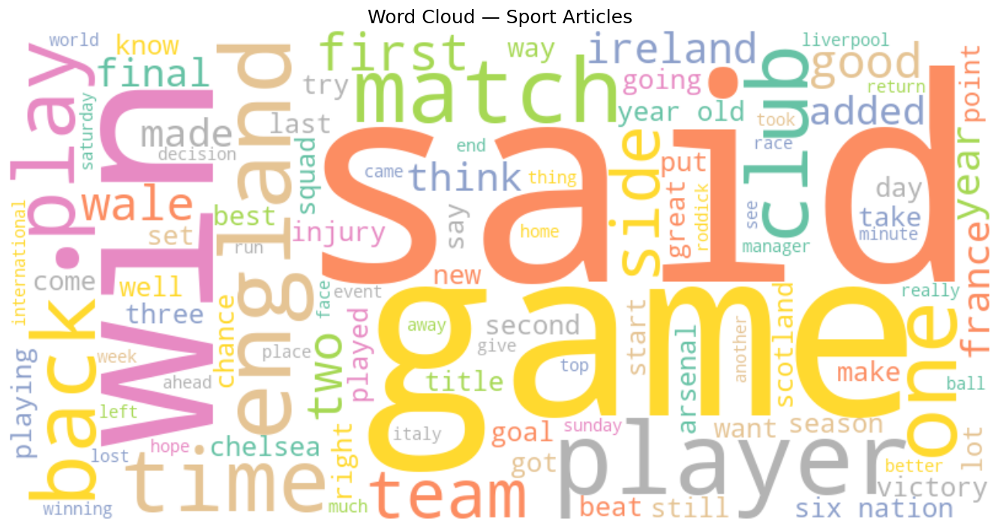

The per-category frequency bars make the task's tractability visible: each category is dominated by a distinct high-frequency vocabulary with little overlap between panels — the qualitative explanation for why even Naive Bayes exceeds 96%.

They also expose frequent but uninformative tokens ("said", "would") that survive stop word removal, since NLTK's list excludes them. Rather than hand-curate an extended stop list, we rely on TF-IDF's IDF term to down-weight them and on Gensim's `filter_extremes` to remove them from the topic model. Section 4.2.1 confirms this worked: LIME finds "said" acting as a *negative* contributor, meaning the classifier learned to discount it unaided.

---

## 4. Model Building

### 4.1 Unsupervised Learning — Topic Modelling (LDA)

#### 4.1.1 Algorithm and Topic Count Selection

Latent Dirichlet Allocation (Blei et al., 2003) was implemented in Gensim. LDA models each document as a mixture over latent topics and each topic as a distribution over words, and never sees the category labels — making the comparison against the known five categories a genuine test of whether the corpus's structure is discoverable without supervision.

A dictionary built from the lemmatised tokens was filtered with `filter_extremes(no_below=5, no_above=0.80)`. This two-sided filter matters: rare terms cannot support a coherent topic, while near-universal terms would otherwise top *every* topic and render them indistinguishable. The filtered dictionary holds **7,692 terms**.

*K* was selected by maximising the **C_v coherence score** (Röder et al., 2015) — measuring how often a topic's top words genuinely co-occur, which correlates better with human interpretability judgements than perplexity. We scanned K ∈ {2,…,12}; the full scan is in **Appendix B.1**.

**Figure 7:** Coherence score vs. number of topics  
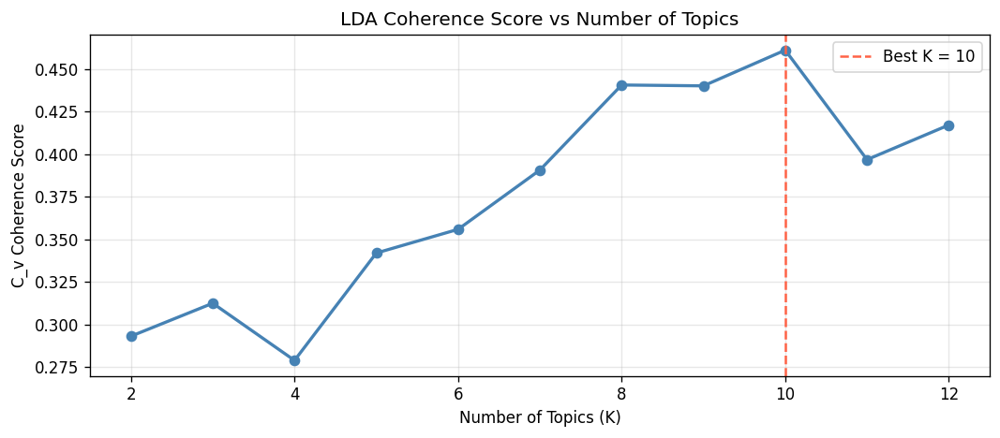

**K = 10 was selected, achieving C_v = 0.4612.** The curve rises to a plateau across K=8–10 before falling away — and significantly, **K=5, the "correct" number of categories, scores only 0.3421**, well below the optimum. The data itself prefers ten topics to five.

#### 4.1.2 Top Words per Topic

The full top-10 keyword table is given in **Appendix B.2**. Summarising the ten discovered topics: music industry (1), gaming/online culture (2), the Greek athletics doping affair (3), athletics/Olympics (4), computing/software (5), mobile telephony (6), markets/corporate finance (7), UK politics (8), club football and rugby (9), and film/awards (10).

#### 4.1.3 Interactive Visualisation

An interactive pyLDAvis visualisation (`outputs/figures/lda_vis.html`) shows the intertopic distance map and per-topic term saliency with an adjustable relevance parameter λ.

**Figure 8:** Topic distribution per category  
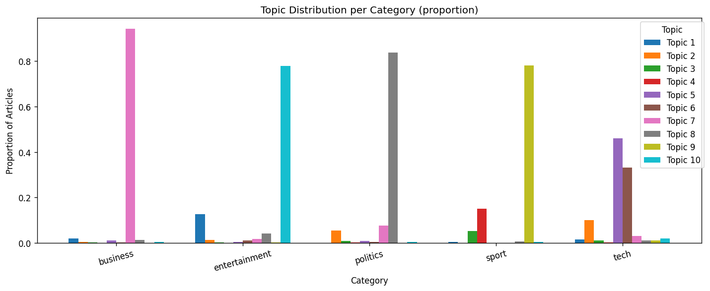

#### 4.1.4 Discussion

The central finding is that **LDA does not recover the five BBC categories one-to-one — it subdivides them** — and this is a success of the method, not a failure.

The mapping is clean but *many-to-one*. **Sport → Topics 4 and 9**, split along a real fault line: individual athletics and Olympic competition (*champion, holmes, olympic*) versus team club competition (*england, club, player, final*). These share a label but almost no vocabulary. **Entertainment → Topics 1 and 10**, split into music and film/awards. **Tech → Topics 5 and 6**, split into computing/patents and mobile telephony. **Business → Topic 7** and **Politics → Topic 8**, each mapping nearly one-to-one.

**Topic 3 is the most interesting result.** Its keywords (*thanou, kenteris, greek, test, visa, blunkett*) correspond to no category — they correspond to a specific *news event*: the 2004 doping scandal in which Greek sprinters Kostas Kenteris and Ekaterini Thanou missed drug tests before the Athens Olympics. LDA isolated a single running story as its own topic, cutting across the sport/politics boundary. No supervised model constrained to five labels could have surfaced this, and it concretely demonstrates what unsupervised topic modelling adds: it discovers the structure *actually* in the corpus rather than the structure we assumed.

Two topics are less clean, reflecting the modest corpus size (Appendix B.2).

**A cross-check.** To test whether this subdivision is real rather than an artefact of K, we re-ran LDA on **sport articles only**, re-tuning K by the same procedure. It selected **K = 4**, independently recovering club football, international rugby, doping/governance, and general competition (details in **Appendix B.3**). That a controlled subset reproduces the same sub-themes — including a doping topic — strongly supports the interpretation that these divisions are genuine properties of the corpus.

The practical conclusion: **the BBC's five-way editorial taxonomy is coarser than the topical structure of its own content**. Our classifiers achieve ~97% precisely because the label set is coarse and the vocabulary boundaries sharp; LDA shows a finer, equally valid organisation exists underneath.

---

### 4.2 Supervised Learning

#### 4.2.1 Task 1 — Text Classification

##### Experimental Protocol

All models train on the dataset's **original train/test split** (1,194 / 932 after deduplication) rather than a fresh random split, keeping results comparable with published benchmarks, and every model is evaluated on the same 932 held-out articles. We report accuracy and **macro** F1 — the latter averaging across classes without weighting by size, so the smallest category (tech, n=151) counts equally with the largest (sport, n=230).

##### Traditional ML Models

| Model | Accuracy | Macro F1 |
|-------|----------|----------|
| **Linear SVM** | **97.00%** | **0.9693** |
| Logistic Regression | 96.78% | 0.9669 |
| Naive Bayes | 96.46% | 0.9628 |

**On data leakage.** We deliberately **refit TF-IDF inside each pipeline on the training split only**, rather than reusing Notebook 1's full-corpus matrix — that matrix was fit on all 2,126 articles including the test set, so its vocabulary and IDF weights encode test-document information that would inflate our scores. The full-corpus matrix is used only for unsupervised visualisation (Section 3.3), where no train/test boundary exists to violate. Placing the vectoriser inside a `Pipeline` makes this leakage-safety structural.

**Figure 9:** Confusion matrices — traditional ML classifiers  
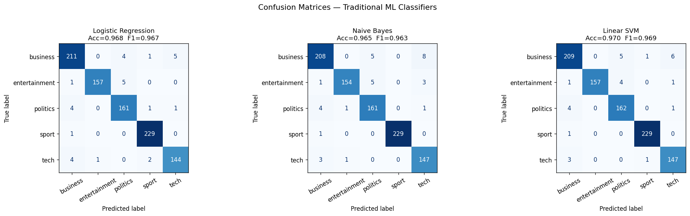

**Figure 10:** Per-class F1 — Linear SVM  
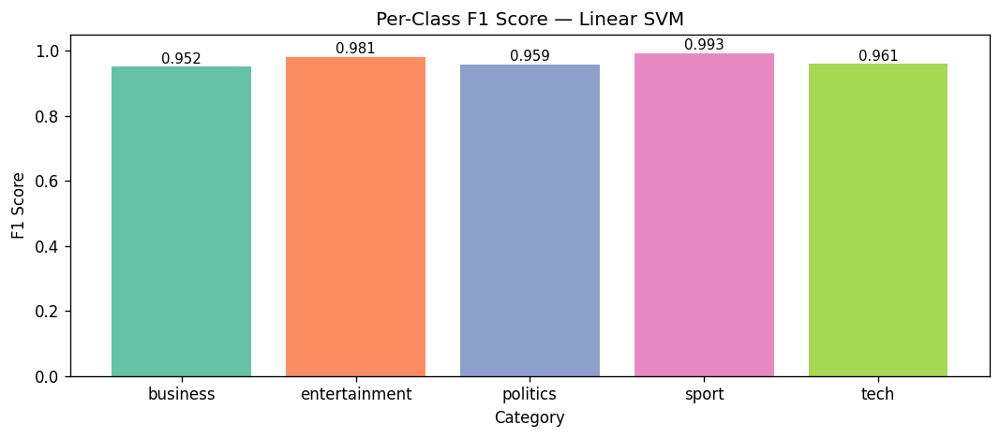

**Why the SVM leads.** The models are separated by ~0.5 points, but the ordering is principled. A linear SVM optimises the *maximum-margin* hyperplane, placing its boundary as far as possible from the nearest training examples — well-suited to high-dimensional sparse text where classes are nearly linearly separable. Logistic regression optimises log-likelihood, fitting *all* points rather than concentrating on boundary cases, yielding a slightly less robust boundary. Naive Bayes trails because its conditional-independence assumption is plainly false for news text: "champions" and "league" co-occur constantly, and NB double-counts such correlated evidence. That it still reaches 96.46% testifies to how separable this dataset is.

Per-class F1 for the SVM ranges from 0.95 (business) to 0.99 (sport), consistent with the t-SNE geometry: sport is the most isolated cluster and easiest class; business, bordering politics and tech, is hardest.

##### Deep Learning — Bidirectional LSTM

A two-layer bidirectional LSTM was trained **from scratch** on lemmatised sequences (vocabulary 15,000, max length 200, embedding dim 128, hidden dim 256, dropout 0.3, ~4.29M parameters) using Adam (lr = 1e-3) with `ReduceLROnPlateau` and gradient clipping over 8 epochs. The vocabulary is built from the **training split only** — the same leakage discipline applied to TF-IDF. Unlike DistilBERT, the LSTM consumes `text_processed`: it operates over a fixed vocabulary it must learn from scratch, so lemmatisation genuinely helps.

| Metric | Value |
|--------|-------|
| Test Accuracy | 81.55% |
| Macro F1 | 0.8099 |

**Figure 11:** BiLSTM training curves  
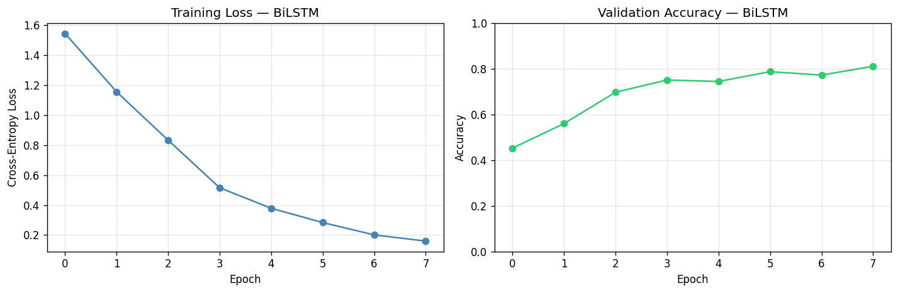

**Figure 12:** BiLSTM confusion matrix  
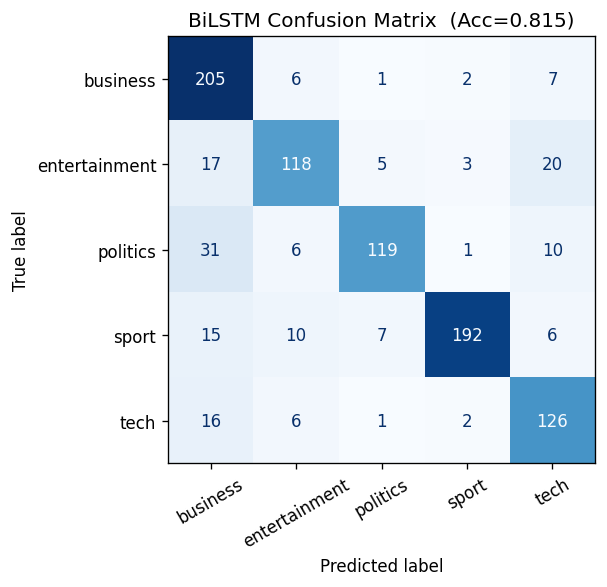

The curves show loss still falling and validation accuracy still climbing at epoch 8: the model is **under-trained rather than converged**. Longer training would add a few points — but would not close a 15-point gap, and epochs are not the cause.

##### Deep Learning — DistilBERT (Fine-tuned)

DistilBERT (`distilbert-base-uncased`, 66.9M parameters) was fine-tuned via the HuggingFace `Trainer`: 4 epochs, batch size 16, learning rate 2e-5 with warmup, weight decay 0.01, inputs truncated to 256 subword tokens. DistilBERT is a distilled BERT variant — ~40% smaller and 60% faster, retaining ~97% of BERT's performance (Sanh et al., 2019) — chosen to keep fine-tuning feasible on consumer hardware. It trains on the **original, unprocessed text**, for the reasons in Section 2.4.

| Metric | Value |
|--------|-------|
| Test Accuracy | **97.21%** |
| Macro F1 | **0.9709** |

**Figure 13:** DistilBERT confusion matrix  
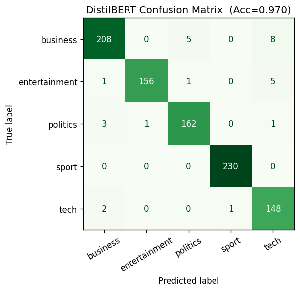

##### Model Comparison

**Figure 14:** Accuracy and Macro F1 across all models  
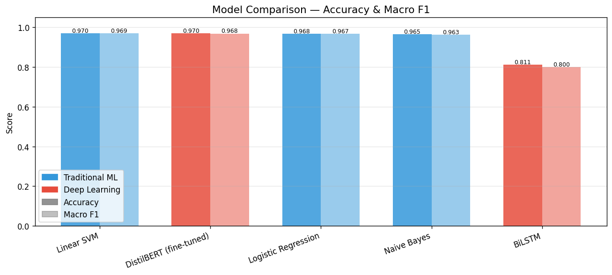

| Model | Type | Accuracy | Macro F1 |
|-------|------|----------|----------|
| **DistilBERT (fine-tuned)** | Deep Learning | **97.21%** | **0.9709** |
| Linear SVM | Traditional ML | 97.00% | 0.9693 |
| Logistic Regression | Traditional ML | 96.78% | 0.9669 |
| Naive Bayes | Traditional ML | 96.46% | 0.9628 |
| BiLSTM (random embeddings) | Deep Learning | 81.55% | 0.8099 |

Two findings emerge, and the second matters more.

**Finding 1: DistilBERT ranks first, but the margin is not meaningful.** Its 0.21-point lead over the SVM is **two additional correct articles out of 932** — well inside the range that shifts between random seeds. Indeed, an earlier run of the same seeded notebook placed DistilBERT marginally *behind* the SVM; that the ordering flips between runs is itself evidence the gap is noise. We therefore make no claim that DistilBERT is meaningfully better. The honest conclusion is that **a 66.9M-parameter transformer and a linear model over word counts are tied** — and the SVM reaches that tie in seconds of CPU training versus minutes of GPU fine-tuning and a ~250MB artefact. On the engineering trade-off the SVM wins outright, which is why our deployed application serves it (Section 4.2.3).

The deeper reason the transformer cannot pull ahead is that **this task does not require what transformers are good at**. DistilBERT's advantage lies in resolving context and word-sense ambiguity — exactly the failure mode we identified for static Word2Vec embeddings around "transfer" in Section 3.2. But BBC categories are so lexically distinct that word *identity* nearly suffices: the presence of "shares" or "scored" settles the question without any need to parse the sentence. With a ~97% ceiling imposed by genuinely ambiguous articles, there is no headroom for contextual understanding to demonstrate value.

**Finding 2: The BiLSTM's 15.7-point deficit is the informative result.** It is a deep neural network, yet decisively beaten by Naive Bayes. The explanation is not architecture but **initialisation**: its embedding layer starts from random noise, so it must learn word meaning *and* the task simultaneously from 1,194 articles. DistilBERT begins from representations pre-trained on billions of words and need only learn the mapping onto five labels.

This isolates the variable cleanly. Our two *deep* models differ by 15.7 points; DistilBERT and a bag-of-words SVM differ by 0.21. **The performance driver here is pre-trained knowledge — not depth, and not "deep learning" as a category.** Where pre-training is unavailable, a well-tuned classical model over good features is not a fallback but a competitive choice.

##### XAI — LIME

We applied **LIME** (Ribeiro et al., 2016), which explains an individual prediction by perturbing the input — repeatedly removing random word subsets — and fitting a local linear surrogate to the resulting probability changes.

LIME is applied to **Logistic Regression rather than the top-ranked SVM**, forced by an implementation detail: LIME requires class *probabilities*, and `LinearSVC` exposes only `decision_function`. Logistic Regression is the closest available model (96.78% vs 97.00%, both linear over identical TF-IDF features), so its explanations are highly representative. This same gap resurfaces in deployment (Section 4.2.3).

**Figure 15:** LIME local explanation — correctly classified sport article  
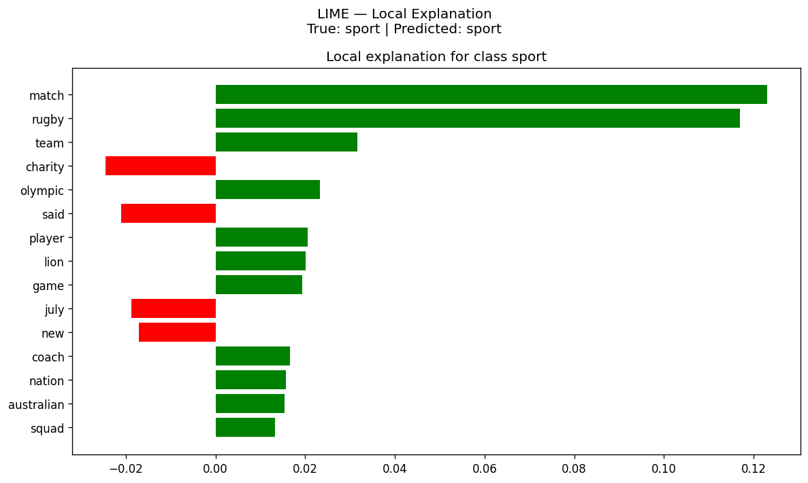

We explained a correctly classified article about a proposed North-versus-South charity rugby match in Sydney. LIME's top contributions toward *sport* are dominated by **`match` (+0.123)** and **`rugby` (+0.117)** — an order of magnitude above the rest — followed by `team` (+0.032), `olympic` (+0.023), `player` (+0.021), `lion` (+0.020) and `game` (+0.019). The explanation is exactly what a domain expert would give: the article is about a rugby match, and the model says so because of the words "rugby" and "match".

Two details deserve comment. **`lion` is genuine domain signal, not noise** — it refers to the British & Irish Lions touring side, and the model learned this sporting sense rather than the animal one. And the words pushing *against* sport — `charity` (−0.024), `said` (−0.021), `july` (−0.017), `new` (−0.017) — are all generic news vocabulary, correctly treated as weak evidence against. **`said` appearing here validates the preprocessing decision from Section 3.4**: we declined to hand-curate an extended stop list, trusting IDF weighting to handle high-frequency non-stopwords, and LIME confirms the classifier learned to discount it unaided.

**Figure 16:** LIME explanation — misclassified article (error analysis)  
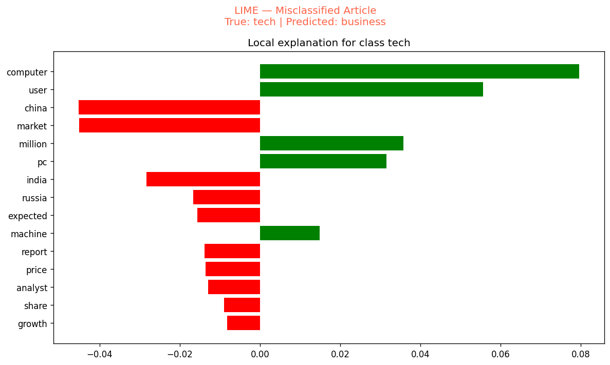

**Figure 17:** Global feature importance — top 12 features per class  
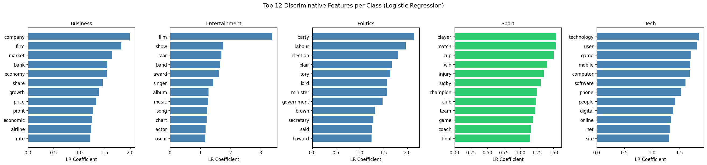

The brief requires explanation "on either a local or global basis"; we provide both. LIME (Figures 15–16) is *local*, explaining one prediction at a time. Figure 17 is *global*, plotting the twelve highest-weighted TF-IDF features per class across the entire model. The views are complementary: the global shows what the model learned overall, the local how those weights combine on a specific document — including where they combine wrongly.

---

#### 4.2.2 Task 2 — Retrieval-Augmented Generation (RAG)

##### System Architecture

RAG (Lewis et al., 2020) addresses a specific weakness of generative models: asked a factual question, they produce fluent text from parametric memory with no guarantee of accuracy and no citable source. RAG retrieves relevant documents first and instructs the model to answer only from them, grounding output in a verifiable corpus.

**Retriever.** All 2,126 articles were encoded with `sentence-transformers/all-MiniLM-L6-v2` (Reimers & Gurevych, 2019) into 384-dimensional vectors, stored in a FAISS `IndexFlatIP` index. We index the **original text** — the encoder is a pre-trained transformer and, as with DistilBERT, performs best on natural language. Because vectors are L2-normalised before indexing, **inner product is mathematically equivalent to cosine similarity**, so `IndexFlatIP` performs exact, exhaustive cosine search. Approximate indexes (IVF, HNSW) exist to make billion-scale search tractable; at 2,126 vectors exhaustive search takes milliseconds, so accepting approximation error would buy nothing.

**Generator.** `google/flan-t5-base` (Chung et al., 2022) generates answers via `AutoModelForSeq2SeqLM`. Flan-T5 is instruction-tuned, so it follows a directive such as "answer using only the articles provided" without task-specific training — essential, as we have no supervised QA data.

**Prompt engineering.** Retrieved articles are truncated to 400 characters, tagged with their category, numbered, and injected into a fixed template:

```
You are a knowledgeable news assistant. Answer using only the articles provided.

Article 1 [sport]: <snippet>
Article 2 [politics]: <snippet>
...

Question: <user query>
Answer:
```

The "only" instruction is the anti-hallucination constraint; category tags give a weak relevance signal; the 400-character truncation keeps the assembled prompt inside Flan-T5's 512-token window even at k=5.

##### Evaluation

The system was evaluated on **10 manually curated questions** grounded in corpus topics, scored with **ROUGE-L** (Lin, 2004), which measures the longest common subsequence between generated and reference answers. Per-question scores are tabulated in **Appendix C.1**.

**Figure 18:** ROUGE-L scores per question  
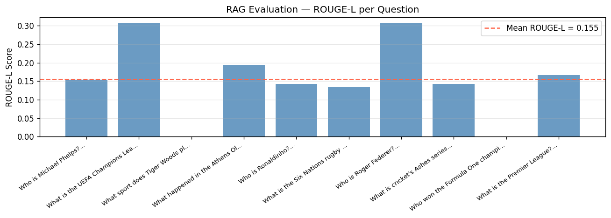

| Metric | Score |
|--------|-------|
| **Mean ROUGE-L** | **0.1549** |
| Best (UEFA Champions League / Roger Federer) | 0.3077 |
| Worst (Tiger Woods / Formula One) | 0.0000 |
| Median | 0.1483 |

##### Discussion

A mean ROUGE-L of 0.155 looks poor, and read naively suggests a broken system. We argue the metric is measuring the wrong thing, and that the low scores are substantially an artefact of evaluation design rather than evidence of failure.

**ROUGE-L rewards lexical overlap with a reference string, not correctness.** It was designed for summarisation, where outputs are long and reference-like. Our references are full sentences ("Tiger Woods is a professional golfer"), while an instruction-tuned model asked a direct question answers tersely — plausibly "golf". That answer is completely correct and scores **exactly zero**, because "golf" and "golfer" are different tokens and no common subsequence exists. Both zero-scoring questions are of this form — short-factoid questions whose ideal answer is one or two words — a strong indication that the metric, not the system, produced them. A terse correct answer and a fluent wrong answer can receive identical ROUGE-L scores; this is a well-documented limitation of n-gram overlap metrics.

**Retrieval can be assessed independently, and it is sound.** The trace for "Who won the football championship?" (Appendix C.2) returns an FA Cup report, a Champions League report, and — revealingly — a review of the video game *Championship Manager*, correctly labelled `tech`. That third hit is not an error but a demonstration that the retriever matches on **semantics rather than keywords**: it understood "championship" in a context the query never disambiguated. The absolute scores (~0.3) are modest but expected — a six-word question compared against 400-word documents yields inherently low cosine between a focused query vector and a diffuse document vector. The scores are informative in their *ranking*, not their magnitude.

**The genuine weaknesses lie elsewhere.** First, **Flan-T5-base is small** (250M parameters); answers are terse and occasionally miss information present in the retrieved context. Second, and more fundamentally, **the corpus cannot answer some of our questions**. It covers 2004–2005; asked "Who won the Formula One championship?", the retriever can only surface contemporary reports, with no single document stating a clean answer. That question is mis-specified for this corpus — a curation weakness on our part, not a system failure.

A better evaluation would report **retrieval metrics separately from generation metrics** and assess answers with a semantic metric such as BERTScore, which credits correct paraphrases ROUGE-L cannot see. Our headline number should be read as a lower bound on system quality; we would not defend 0.155 as a meaningful measurement of whether this RAG system works.

---

#### 4.2.3 Task 3 — Streamlit UI and Deployment

##### Application Design

An interactive Streamlit application (`app/app.py`) provides two tabs: an **Article Classifier**, where the user pastes news text and receives a predicted category with per-class confidence as a bar chart; and a **Sports & News Q&A (RAG)** tab, where the user enters a question and a `k` slider (1–5) controlling retrieval depth, receiving a generated answer with source articles in an expandable panel. Both models load behind `@st.cache_resource`, initialising once per session rather than per interaction.

**We deploy the Linear SVM, not DistilBERT** — despite DistilBERT ranking marginally higher. The SVM pipeline is a few megabytes and predicts in milliseconds on CPU; DistilBERT is ~250MB and materially slower without a GPU. Given a 0.21-point difference we have argued is not meaningful, the trade-off favours the SVM decisively. This is a concrete instance of the report's central finding: **the best model on a leaderboard is not always the right model to ship.**

**The RAG tab exposes its sources.** The expandable panel showing each retrieved article with its similarity score lets a user verify an answer is grounded in real articles and diagnose whether a poor answer stems from bad retrieval or bad generation — the very distinction our ROUGE-L analysis identified as unmeasured.

Deployment also surfaced the same `LinearSVC` limitation as LIME: with no `predict_proba`, the confidence chart applies a softmax over `decision_function` outputs — *calibrated-looking but not calibrated* probabilities, adequate for relative confidence in a UI but not to be read as true posteriors.

[FILL IN: insert 1–2 screenshots of the running app here — one per tab]

##### Deployment

The application is deployed publicly on HuggingFace Spaces at **https://huggingface.co/spaces/Geoanto/bbc-news-assistant**, using the Docker SDK with five artefacts: `app.py`, `requirements.txt`, `best_ml_pipeline.pkl`, `faiss_index.index` and `articles_for_rag.csv`. The most significant issue was image size: the default `torch` wheel bundles CUDA libraries irrelevant to a CPU-only Space, producing a ~2.5GB image and slow cold starts. Pinning the CPU-only build reduced this to ~200MB.

##### User Experience Evaluation

Informal use surfaced three limitations, discussed with proposed improvements in **Appendix D.1**: cold-start latency on the first RAG query; terse answers that reflect generator size rather than retrieval quality; and a classifier that accepts out-of-distribution input and still confidently names one of five BBC categories, having no notion of "none of these".

---

## 5. Conclusions and Future Work

### 5.1 Summary of Findings

**Pre-training, not depth, separates the models.** Our two deep learning models sit at opposite ends of the results table — DistilBERT first at 97.21%, the BiLSTM last at 81.55%, a 15.7-point gap between two neural networks — while DistilBERT and a linear SVM over word counts differ by 0.21. What explains our results is not whether a model is "deep" but whether it starts from pre-trained knowledge; from-scratch neural models are not competitive at this data scale, where they must learn word meaning and the task simultaneously from 1,194 documents.

**Classical machine learning remains genuinely competitive, and won the deployment decision.** The Linear SVM matched a 66.9M-parameter transformer to within two test articles, trains in seconds on CPU, and is what we shipped. Where categories are lexically distinct, word identity carries nearly all the signal and contextual understanding has almost no headroom in which to prove its value.

**Unsupervised topic modelling found structure the labels do not encode.** Coherence optimisation selected ten topics, not five, subdividing categories along real fault lines, and Topic 3 isolated a specific news event (the Kenteris/Thanou doping affair) cutting across categories entirely. The t-SNE projection shows the same sub-structure geometrically, and a controlled re-run on sport alone reproduced it independently. The editorial taxonomy is coarser than the corpus.

**Our RAG evaluation measured the wrong thing, and we can say why.** Mean ROUGE-L of 0.155 reads as failure but substantially reflects a metric that scores a correct one-word answer at zero when the reference is a full sentence — exactly what happened on both zero-scoring questions. Retrieval, assessed independently, is sound; the genuine limitations are generator size and a corpus that cannot answer some questions we posed.

**Explainability confirmed the models learned domain-appropriate features.** LIME attributed a sport prediction overwhelmingly to `match` and `rugby`, read `lion` in its sporting sense, and treated generic news vocabulary as evidence *against* the class — independently validating a preprocessing decision made on other grounds.

### 5.2 Future Work

**Initialise the BiLSTM from pre-trained embeddings.** The cleanest test of this report's main claim: keep the architecture identical and swap random initialisation for GloVe or FastText vectors. If pre-training rather than depth drives our results, most of the 15.7-point gap should close with no change in model capacity. FastText would additionally handle the out-of-vocabulary athlete and company names a small corpus produces in abundance.

**Rebuild the RAG evaluation.** The current protocol cannot distinguish retrieval failure from generation failure from metric artefact. We would annotate relevant articles per question and report Recall@k and MRR for the retriever separately, score answers with BERTScore or an LLM-as-judge to credit correct paraphrases, and curate questions verified answerable from a 2004–2005 corpus.

**Chunk documents for retrieval.** We embed whole articles, averaging a 400-word document into one 384-dimensional vector — which is why query-document similarities sit near 0.3. Paragraph-level chunks would produce sharper matches and let the prompt carry the relevant passage, likely improving answers more cheaply than a larger generator.

**Compare against BERTopic.** BERTopic clusters contextual sentence embeddings rather than bag-of-words topics, testing whether the same ten themes emerge from a fundamentally different method — on a corpus where we now know roughly what the answer looks like.

**Test the ceiling hypothesis on a harder corpus.** Our central claim is that classical ML matches transformers *because BBC categories are lexically distinct*. That predicts the gap should widen on tasks requiring contextual disambiguation — fine-grained sentiment, sarcasm detection, multi-label tagging. Running the same pipeline there would confirm or falsify the explanation.

---

## References

1. Greene, D. & Cunningham, P. (2006). *Practical Solutions to the Problem of Diagonal Dominance in Kernel Document Clustering*. Proc. 23rd International Conference on Machine Learning (ICML), pp. 377–384.
2. Devlin, J., Chang, M.-W., Lee, K., & Toutanova, K. (2019). *BERT: Pre-training of Deep Bidirectional Transformers for Language Understanding*. NAACL-HLT.
3. Sanh, V., Debut, L., Chaumond, J., & Wolf, T. (2019). *DistilBERT, a distilled version of BERT: smaller, faster, cheaper and lighter*. arXiv:1910.01108.
4. Mikolov, T., Chen, K., Corrado, G., & Dean, J. (2013). *Efficient Estimation of Word Representations in Vector Space*. ICLR.
5. Blei, D. M., Ng, A. Y., & Jordan, M. I. (2003). *Latent Dirichlet Allocation*. Journal of Machine Learning Research, 3, 993–1022.
6. Röder, M., Both, A., & Hinneburg, A. (2015). *Exploring the Space of Topic Coherence Measures*. Proc. 8th ACM International Conference on Web Search and Data Mining (WSDM), pp. 399–408.
7. Lewis, P., et al. (2020). *Retrieval-Augmented Generation for Knowledge-Intensive NLP Tasks*. NeurIPS.
8. Ribeiro, M. T., Singh, S., & Guestrin, C. (2016). *"Why Should I Trust You?": Explaining the Predictions of Any Classifier*. KDD.
9. Chung, H. W., et al. (2022). *Scaling Instruction-Finetuned Language Models (Flan-T5)*. arXiv:2210.11416.
10. Johnson, J., Douze, M., & Jégou, H. (2019). *Billion-Scale Similarity Search with GPUs*. IEEE Transactions on Big Data.
11. Reimers, N. & Gurevych, I. (2019). *Sentence-BERT: Sentence Embeddings using Siamese BERT-Networks*. EMNLP.
12. Lin, C.-Y. (2004). *ROUGE: A Package for Automatic Evaluation of Summaries*. Text Summarization Branches Out, ACL Workshop.

---

# Appendices

## Appendix A — Preprocessing and Embeddings

### A.1 Before/After Preprocessing Example

A tech article on ringtone regulation, first 320 characters:

> **Original:** `tough rules for ringtone sellers firms that flout rules on how ringtones and other mobile extras are sold could be cut off from all uk phone networks. the rules allow offenders to be cut off if they do not let consumers know exactly what they get for their money and how to turn off the services. the first month under…`

> **Processed:** `tough rule ringtone seller firm flout rule ringtones mobile extra sold could cut phone network rule allow offender cut let consumer know exactly get money turn service first month new rule seen least ten firm suspended clean way work rule brought ensure problem plaguing net user spread mobile phone last couple year rin…`

The article shrinks from 630 words to 318 tokens — a 49.5% reduction — while every topically diagnostic term (`ringtone`, `mobile`, `phone`, `network`, `consumer`) survives.

### A.2 Word2Vec Nearest Neighbours

Top-8 most similar words per query, by cosine similarity over the trained Skip-gram model:

| Query | Top-8 most similar words |
|-------|--------------------------|
| **football** | corinthian, league, ibrox, club, judo, punish, sponsorship, anfield |
| **champion** | henin, yelling, maurice, hardenne, compatriot, wimbledon, kenenisa, hayley |
| **injury** | knee, hamstring, neck, groin, surgery, shoulder, ankle, ligament |
| **transfer** | lure, construed, worded, smart, celestine, edu, morientes, sponsorship |
| **olympic** | medallist, holmes, athens, radcliffe, vault, heptathlon, gebrselassie, medal |

Selected similarity scores: knee 0.784, hamstring 0.779, ligament 0.717 (`injury`); medallist 0.859, holmes 0.796, athens 0.796 (`olympic`).

**Failure case — polysemy.** The `transfer` neighbourhood ("lure", "construed", "worded", "smart", "celestine", "edu", "morientes") is markedly noisier than the others. The cause is polysemy: in a news corpus "transfer" occurs in football transfer windows, business asset transfers, and technology data transfers. Word2Vec assigns one vector per word *type*, so these three unrelated senses are averaged into a single incoherent representation, and the nearest neighbours are drawn from all three contexts at once. The `champion` neighbourhood shows a milder version of the same effect, mixing tennis players (Henin, Hardenne) with unrelated tokens ("yelling", "maurice").

This is the defining limitation of static embeddings and the motivation for contextual models such as BERT, which compute a distinct vector for each *occurrence* of a word based on its surrounding sentence. Section 4.2.1 argues that BBC News gives this advantage almost no room to matter — which is why our fine-tuned transformer only ties a bag-of-words SVM.

---

## Appendix B — Topic Modelling Detail

### B.1 Full C_v Coherence Scan

| K | C_v Coherence | K | C_v Coherence |
|---|---------------|---|---------------|
| 2 | 0.2932 | 8  | 0.4407 |
| 3 | 0.3125 | 9  | 0.4402 |
| 4 | 0.2790 | **10** | **0.4612** ← selected |
| 5 | 0.3421 | 11 | 0.3969 |
| 6 | 0.3560 | 12 | 0.4172 |
| 7 | 0.3908 | | |

### B.2 Top-10 Keywords per Topic (K=10)

| Topic | Top-10 keywords | Interpretation |
|-------|-----------------|----------------|
| 1 | music, band, edward, top, back, new, year, sale, one, group | Music industry |
| 2 | game, time, people, brown, life, online, would, world, hour, gaming | Gaming / online culture |
| 3 | test, thanou, greek, blunkett, year, also, game, visa, kenteris, new | Greek athletics doping affair |
| 4 | world, time, year, champion, holmes, olympic, speed, european, best, championship | Athletics / Olympics |
| 5 | technology, software, patent, company, network, machine, computer, one, people, new | Computing / software |
| 6 | mobile, phone, people, also, woman, game, digital, handset, get, technology | Mobile telephony |
| 7 | year, company, market, share, firm, would, price, month, sale, also | Markets / corporate finance |
| 8 | would, election, government, labour, party, minister, blair, police, say, tory | UK politics |
| 9 | england, club, win, game, year, time, first, player, play, final | Club football / rugby |
| 10 | film, year, best, award, show, star, also, new, time, west | Film / awards |

**Less coherent topics.** Two topics did not fully resolve. Topic 2 mixes gaming coverage (*game, online, gaming*) with apparent political spillover — "brown" is almost certainly Gordon Brown, then Chancellor, rather than a gaming term. Topic 1 contains "edward" among otherwise clean music vocabulary. Both are instances of **proper-noun intrusion**, a known symptom of running LDA on a modest corpus: ~2,100 documents is at the low end for the method, and a name appearing frequently within a narrow set of articles can attract enough probability mass to surface among a topic's top words without being topically diagnostic. A larger corpus, or named-entity filtering during preprocessing, would likely resolve both.

### B.3 Sport-Only LDA Cross-Check

LDA re-run on the sport subset alone, with K re-tuned by the same coherence procedure over K ∈ {2,…,8}. **K = 4 selected** (coherence 0.4784):

| Sport Topic | Top-10 keywords | Interpretation |
|-------------|-----------------|----------------|
| 1 | said, game, club, player, chelsea, time, would, united, league, goal | Club football |
| 2 | england, game, wale, ireland, half, side, six, first, back, said | International rugby (Six Nations) |
| 3 | said, would, drug, test, also, sport, kenteris, year, iaaf, doping | Doping / governance |
| 4 | year, world, said, final, win, first, last, second, time, open | General competition |

That a controlled subset independently reproduces the athletics/club-sport division — and a distinct doping topic — supports the interpretation that these sub-themes are genuine properties of the corpus rather than an artefact of K selection on the full dataset.

---

## Appendix C — RAG Evaluation Detail

### C.1 Per-Question ROUGE-L Scores

| Question | ROUGE-L |
|----------|---------|
| Who is Michael Phelps? | 0.1538 |
| What is the UEFA Champions League? | 0.3077 |
| What sport does Tiger Woods play? | 0.0000 |
| What happened in the Athens Olympics? | 0.1935 |
| Who is Ronaldinho? | 0.1429 |
| What is the Six Nations rugby tournament? | 0.1333 |
| Who is Roger Federer? | 0.3077 |
| What is cricket's Ashes series? | 0.1429 |
| Who won the Formula One championship? | 0.0000 |
| What is the Premier League? | 0.1667 |

Mean 0.1549 · Median 0.1483 · Best 0.3077 · Worst 0.0000 (2 of 10)

### C.2 Retrieval Trace Example

Query: *"Who won the football championship?"* (k=3)

| Rank | Category | Cosine | Article |
|------|----------|--------|---------|
| 1 | sport | 0.312 | Southampton/Portsmouth FA Cup fourth-round draw |
| 2 | sport | 0.300 | All four English clubs reach Champions League knockout stages |
| 3 | tech | 0.293 | Review of the *Championship Manager* video game series |

The third hit demonstrates semantic rather than keyword matching: the retriever surfaced a genuine sense of "championship" that the query did not disambiguate.

---

## Appendix D — Deployment Detail

### D.1 User Experience Evaluation and Proposed Improvements

Informal use surfaced three limitations.

**Cold-start latency** is the most visible: the first RAG query after a Space wakes must download and load Flan-T5, taking tens of seconds behind only a generic spinner. *Improvement:* stream tokens as they generate rather than blocking on the complete answer, and surface explicit load-stage progress.

**Answers are terse**, reflecting the generator's size rather than retrieval quality — a user cannot tell the difference without opening the sources panel. *Improvement:* display retrieval scores prominently and warn when the top score falls below a threshold, signalling that the corpus likely cannot answer the question; add example queries as clickable chips to communicate the corpus's 2004–2005 scope before a user asks about recent events.

**The classifier accepts any text**, including from domains the model has never seen, on which it will still confidently name one of five BBC categories — the pipeline has no notion of out-of-distribution input. *Improvement:* surface an explicit low-confidence state rather than always committing to a label, thresholding on the softmax-transformed decision scores described in Section 4.2.3.

---

*Main body word count target: 5,000 ± 500 words. Appendices contain supporting tables and extended analysis referenced from the main text.*
